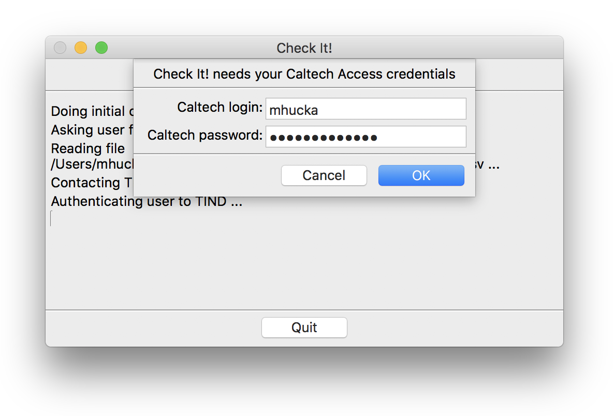

Check It!
=========

_Check It!_ is a program to help Caltech Librarians perform inventory.  It takes a list of bar codes and generates a CSV file containing information about the items drawn from Caltech's TIND server.

[](https://choosealicense.com/licenses/bsd-3-clause)
[](https://www.python.org/downloads/release/python-360/)
[](https://github.com/caltechlibrary/checkit/releases)


Table of contents
-----------------

* [Introduction](#introduction)
* [Installation](#installation)
* [Usage](#usage)
* [Known issues and limitations](#known-issues-and-limitations)
* [Getting help](#getting-help)
* [License](#license)
* [Authors and history](#authors-and-history)
* [Acknowledgments](#authors-and-acknowledgments)


Introduction
------------

Caltech Librarians need to identify what is and is not on the shelves of the library stacks.  One of the processes currently being used is to scan the barcodes of items on the shelves and compare the results to what is expected, based on the library's information management system (an instance of the [TIND ILS](https://info.tind.io/ILS)).  _Check It!_ is a program to take a list of barcodes and create a spreadsheet of information about the items determined from Caltech.tind.io.


Installation
------------

The developers provide an installer program for Caltech Library users.  Please contact the developers to get a copy of the installer program for Windows 7, Windows 10, or macOS 10.13+.  Note also that installation of _Check It!_ on Windows requires administrator privileges.

Alternatively, you can also build the program from the source code.
First, if you don't have the `pip` package or are uncertain if you do, run the following command in a terminal command line interpreter: 
```
sudo python3 -m ensurepip
```

Next, use `git` to clone a copy of the program source tree from the GitHub 
repository to your local computer disk, and then run `pip` to make it install from the source directory.
```sh
git clone --recursive https@github.com:caltechlibrary/checkit.git
cd checkit
python3 -m pip install . --user --upgrade
```


Usage
-----

Check It! has both a graphical user interface (GUI) and a command-line interface.  If you start the application by double-clicking the ready-to-run installed version, it will use the GUI version automatically; if you run the application from a command line, it will still use the GUI interface unless given the command-line argument `-G` (or `/G` on Windows), in which case it will operate purely in a command-line interface mode.


### The graphical user interface

The GUI interface is simple: a user starts the program in a typical way (e.g., by double-clicking the program icon) and Check It! immediately begins its work.  First, Check It! will open a dialog box for an input file.  This can be a CSV file with one barcode per line, or even a plain text file with one barcode per line.  here is an example:

```
35047019298421
35047016806341
35047013986138
```

Next, it will ask the user for their Caltech Access user name and password.

<p align="center">

</p>

Check It! will store the access information in a secure keyring facility provided by the operating system, so that the next time it is run, Check It! will provide the previous login and password as default responses so that the user only has to press the return key or click the **OK** button.

Once it has login credentials, Check It! gets to work contacting Caltech.tind.io to gather information about each barcode given in the input file.  (This may take some time if there are a lot of barcodes to process.)

When it is done, it will present the user with one more file dialog, this time to create a destination output file where the results will be written.  The format of the output is a CSV file with various fields such as the status of the item, the location, etc.  As an example, here is the output for the three barcodes listed above:

```
Flag,Barcode,Status,Call number,Copy number,Location code,Location name,TIND id,Item type,Holdings total
original,35047019298421,on shelf,QH313 .S962 2009,c.1,sfm2,SFL 2 books,697884,Book,2
added,35047018911974,on loan,QH313 .S962 2009,c.2,sfm2,SFL 2 books,697884,Book,2
original,35047016806341,on shelf,QH313 .F66 2001,c.1,sfm2,SFL 2 books,652039,Book,1
original,35047013986138,on shelf,QA402.3 .Z48 1996,c.1,sfm,SFL basement books,613338,Book,2
```

Note that the output has more lines than the input.  One of the purposes of Check It! is to identify items that should be on the shelf, but are not.  It therefore checks all the holdings recorded for a given item in Caltech.tind.io, and if any of them are marked with a status other than "on shelf", it adds rows to the output under the related item.  These are noted with the word "added" in the first column.  Thus, in the output above, the 2nd item with a status of "on loan" is something added by Check It!.


### The command-line interface

When started with the `-G` or `--no-gui` option (`/G` on Windows), Check It! will not start the graphical user interface and instead work entirely from the command line.  The `checkit` command-line program should end up installed in a location where software is normally installed on your computer, if the installation steps described in the previous section proceed successfully.  Running Check It! from a terminal shell then should be as simple as running any other shell command on your system:

```bash
checkit -h
```

If that fails for some reason, you should be able to run Check It! from anywhere using the normal approach for running Python modules:

```bash
python3 -m checkit -h
```

The `-h` option (`/h` on Windows) will make `checkit` display some help information and exit immediately.

When not printing help, `checkit` will begin by asking the user for the input file containing the list of barcodes to search for.  If given the command-line option `-i` (or `/i` on Windows) followed by a file path name, it will use that file as the input instead of asking the user.

Next, it will ask the user for a Caltech Access user name and password.  By default, Check It! uses the operating system's keyring/keychain functionality to get a user name and password.  If the information does not exist from a previous run of `checkit`, it will query the user interactively for the user name and password, and unless the `-K` argument (`/K` on Windows) is given, store them in the user's keyring/keychain so that it does not have to ask again in the future.  It is possible to supply the information directly on the command line using the `-u` and `-p` options (or `/u` and `/p` on Windows), but this is discouraged because it is insecure on multiuser computer systems.

Once it has login credentials, Check It! gets to work contacting Caltech.tind.io to gather information about each barcode given in the input file.  (This may take some time if there are a lot of barcodes to process.)

When it is done, it Check It! ask the user for a destination output file where the results will be written.  If given the command-line option `-o` (or `/o` on Windows) followed by a file path name, it will instead use that file as the output destination.  The format of the output is the same as that described in the section for the GUI interface above.

When running in command-line mode, Check It! produces color-coded diagnostic output as it runs, by default.  However, some terminals or terminal configurations may make it hard to read the text with colors, so Check It! offers the `-C` option (`/C` on Windows) to turn off colored output.

If given the `-@` argument (`/@` on Windows), this program will output a detailed trace of what it is doing, and will also drop into a debugger upon the occurrence of any errors.  The debug trace will be written to the given destination, which can be a dash character (`-`) to indicate console output, or a file path.

If given the `-V` option (`/V` on Windows), this program will print the version and other information, and exit without doing anything else.


### _Command line options summary_

The following table summarizes all the command line options available. (Note: on Windows computers, `/` must be used as the prefix character instead of the `-` dash character):

| Short&nbsp;&nbsp;&nbsp;&nbsp;&nbsp; | Long&nbsp;form&nbsp;opt | Meaning | Default |  |
|---------- |-------------------|----------------------|---------|---|
| `-C`      | `--no-color`      | Don't color-code the output | Use colors in the terminal output |
| `-G`      | `--no-gui`        | Use the command-line interface | Start the GUI interface | |
| `-h`      | `--help`          | Display help text and exit | | |
| `-i`_I_   | `--input-csv`_I_  | Use file _I_ as the input list of barcodes | Prompt for the input file | | 
| `-K`      | `--no-keyring`    | Don't store credentials in system keyring | Store credentials |
| `-o`_O_   | `--output-csv`_O_ | Write outputs to CSV file _O_ | Prompt for the output file | |
| `-p`_P_   | `--password`_P_   | Password for Caltech Access | Prompt for the password | |
| `-q`      | `--quiet`         | Don't print messages while working | Be chatty while working |
| `-u`_U_   | `--user`_U_       | User name for Caltech Access | Prompt for the user name |
| `-V`      | `--version`       | Display program version info and exit | | |
| `-@`_OUT_ | `--debug`_OUT_    | Debugging mode; write trace to _OUT_ | Normal mode | ⬥ |

⬥ &nbsp; To write to the console, use the character `-` as the value of _OUT_; otherwise, _OUT_ must be the name of a file where the output should be written.


Known issues and limitations
----------------------------

For each barcode, Check It! does _not_ print information about other copies of the same item if the copies are marked as "on shelf" in Caltech.tind.io.  It only writes out related items if they have a status other than "on shelf".


Getting help
------------

If you find an issue, please submit it in [the GitHub issue tracker](https://github.com/caltechlibrary/checkit/issues) for this repository.


License
-------

Software produced by the Caltech Library is Copyright (C) 2019, Caltech.  This software is freely distributed under a BSD/MIT type license.  Please see the [LICENSE](LICENSE) file for more information.


Authors and history
---------------------------

[Mike Hucka](https://github.com/mhucka) implemented Check It! in 2019 at the request of Caltech Library staff, particularly [Laurel Narizny](https://github.com/lnarizny) and [Andy Gaston](https://www.library.caltech.edu/person/andy-gaston).


Acknowledgments
---------------

The [vector artwork](https://thenounproject.com/ravindrakalkani/uploads/?i=2096134) used as a starting point for the logo for this repository was created by [Ravindra Kalkani](https://thenounproject.com/ravindrakalkani/) for the [Noun Project](https://thenounproject.com).  It is licensed under the Creative Commons [Attribution 3.0 Unported](https://creativecommons.org/licenses/by/3.0/deed.en) license.  The vector graphics was modified by Mike Hucka to change the color.

Check It! makes use of numerous open-source packages, without which it would have been effectively impossible to develop Check It! with the resources we had.  I want to acknowledge this debt.  In alphabetical order, the packages are:

* [Beautiful Soup](https://www.crummy.com/software/BeautifulSoup/) &ndash; an HTML parsing library
* [colorful](https://github.com/timofurrer/colorful) &ndash; terminal/text string styling
* [distro](https://github.com/nir0s/distro)  &ndash; access information about an installed package
* [ipdb](https://github.com/gotcha/ipdb) &ndash; the IPython debugger
* [keyring](https://github.com/jaraco/keyring) &ndash; a library to access the system keyring service from Python
* [lxml](https://lxml.de) &ndash; an XML parsing library for Python
* [nameparser](https://github.com/derek73/python-nameparser) &ndash; simple Python module for parsing human names into their individual components
* [plac](http://micheles.github.io/plac/) &ndash; a command line argument parser
* [PyInstaller](http://www.pyinstaller.org) &ndash; a packaging program that creates standalone applications from Python programs
* [Pypubsub](https://github.com/schollii/pypubsub) &ndash; a publish-and-subscribe message-passing library for Python
* [requests](http://docs.python-requests.org) &ndash; an HTTP library for Python
* [setuptools](https://github.com/pypa/setuptools) &ndash; library for `setup.py`
* [urllib3](https://github.com/urllib3/urllib3) &ndash; Python HTTP library with thread-safe connection pooling, file post support, and more
* [wxPython](https://wxpython.org) &ndash; a cross-platform GUI toolkit for the Python language

This work was funded by the California Institute of Technology Library.

<div align="center">
  <br>
  <a href="https://www.caltech.edu">
    
  </a>
</div>
